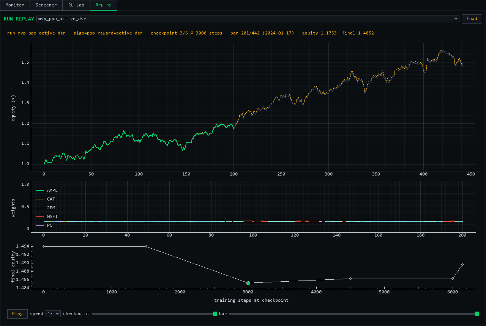

# Signal Gym / Vision

**Vision** is a locally-run, dark-themed trading intelligence terminal
(`python -m gym.run vision`) with four modules in one window:

- **Monitor** — read-only portfolio tracking from `portfolio_state.json`: P&L table,
  weights, a 60-day return-correlation heatmap, and an optional 5-minute auto-refresh.
- **Screener** — technical snapshots in a colour-coded, sortable table (click any
  header), plus quantile return projections with an out-of-sample coverage honesty check.
- **RL Lab** — the FinRL control panel, embedded whole.
- **Replay** — recorded training runs played back bar-by-bar: a **checkpoint scrubber**
  (watch the policy change across training), stacked-area portfolio weights, and causal
  bull/bear/choppy **regime shading** behind the equity curve.



More screenshots in [`docs/screenshots/`](docs/screenshots/). Vision never routes
orders — everything here is research-only.

At its core sits **Signal Gym**, a research framework for training reinforcement-learning
agents to allocate a **long-only, multi-asset spot portfolio** from **price-only (OHLCV)
features**, and for answering one question honestly:

> Is there generalizable, feature-driven allocation edge over a naive equal-weight portfolio —
> and which reward objective actually selects for it?

The reward objective is not assumed. Several candidate rewards are trained head-to-head and
judged on out-of-sample data with a significance gate, so the framework reports a defensible
*positive* result or a rigorous *negative* one — never a metric flattering itself.

## How it works

Each run is a pipeline:

1. **Data.** Daily OHLCV for a chosen universe is downloaded and enriched with standard
   technical indicators. A per-bar covariance matrix is added from a trailing window of past
   returns (strictly causal — no future bars enter any observation).
2. **Environment.** An agent observes the current bar (covariance + indicators) and emits a
   raw score per asset; a softmax turns it into portfolio weights — a long-only point on the
   simplex that sums to 1. The realized return is the weighted basket return over the *next*
   bar, so a decision only ever earns the move that follows it. Turnover is charged a
   transaction cost, so churn is never free.
3. **Reward.** The per-step training reward is pluggable (see [Rewards](#rewards)). Each
   candidate is online and causal — it reads only the latest bar and a running estimate of the
   past, never the whole episode.
4. **Training.** One policy is trained per candidate reward (PPO by default; SAC or A2C
   via `--algo`). Pass a `runlog.RunRecorder` to record checkpointed rollouts for replay.
5. **Evaluation.** The out-of-sample period is split chronologically into a **validation** and
   a **test** slice. Each agent is scored on both. Candidates are ranked by **validation**
   `active_sharpe` (the information ratio versus an equal-weight benchmark); the test column is
   reported but never used for selection.
6. **Significance gate.** The selected champion's test performance is run through a Monte-Carlo
   permutation test (sign-flip on the active-return Sharpe) and a Wald–Wolfowitz runs test, so
   an apparent edge has to clear a noise threshold before it counts.
7. **Regime breakdown.** Test bars are labeled bull / bear / choppy from a causal trailing
   trend of the benchmark, and performance is reported per regime — a flat verdict can hide a
   regime effect, so it is split out.

Every run serializes its full config and seed to a JSON manifest and appends a dated entry to
the research log.

## Design constraints

- **Long-only spot** — no shorting, leverage, derivatives, or options.
- **Research only** — backtest/evaluation; no broker execution and no real capital.
- **Price-only** — features derive from OHLCV; no news, fundamentals, or order-book data.
- **No lookahead** — at bar `t` only bars ≤ `t` are observable; fills happen on the next bar;
  the covariance and benchmark labels use trailing windows only.
- **Reproducible & leakage-free** — identical config + seed reproduce a run; selection touches
  validation only, and the test slice is scored once.

## Quick start

The framework runs in the project virtual environment (Python 3.11, with PyTorch, Stable-
Baselines3, FinRL, and PyQt5).

Run the reward investigation from the command line:

```bash
# default diversified basket, daily data
python -m gym.run investigate --timesteps 20000

# choose your own universe, dates, training budget, and device
python -m gym.run investigate \
    --tickers AAPL MSFT JPM XOM CAT PG JNJ WMT \
    --train-start 2014-01-01 --train-end 2022-01-01 \
    --trade-start 2022-01-01 --trade-end 2024-01-01 \
    --timesteps 50000 --lookback 60 --device cpu
```

This prints a ranked comparison table, the verdict, and the significance gate; writes a
reproducibility manifest to `reports/`; and appends a dated entry to
[`RESEARCH_LOG.md`](RESEARCH_LOG.md). Pass `--no-log` to skip the log/manifest.

Screen a basket's current technical state (uses the local OHLCV cache, fetching what's
missing), project h-day return bands, replay a recorded run, or promote one through the
formal backtester:

```bash
python -m gym.run screen  --tickers AAPL MSFT JPM XOM
python -m gym.run project --tickers AAPL MSFT JPM XOM --horizon 20
python -m gym.run replay                       # scrub the latest recorded training run
python -m gym.run promote --slippage-bps 5     # formal backtest with frictions
python -m gym.run walkforward --folds 4        # rolling retrain -> stitched OOS + gate
python -m gym.run vision                       # the full terminal
```

`replay` and `promote` work on **recorded runs** under `gym/runs/`. Record one by
training with a recorder (the replay never retrains — every checkpoint's rollout is
snapshotted to disk):

```python
from pipeline import FinRLConfig
from portfolio import prepare_portfolio_data, train_portfolio
from runlog import RunRecorder

cfg = FinRLConfig(tickers=["AAPL", "MSFT", "JPM", "XOM"])
train_df, trade_df = prepare_portfolio_data(cfg, lookback=60)
rec = RunRecorder(trade_df, cfg, reward="active_dsr", algo="ppo",
                  every=1500, timesteps=6000)         # checkpoint every 1500 steps
train_portfolio(train_df, cfg, reward="active_dsr", timesteps=6000, recorder=rec)
```

Or drive it visually from the desktop control panel:

```bash
python gym/control_panel.py
```

Open the **Reward Investigation (multi-asset)** tab, set the universe and training budget, and
press **Run**. You get a live log, a bar chart of validation-vs-test `active_sharpe` per
reward, the champion's equity against the equal-weight benchmark, and the verdict + gate.

## Rewards

The candidate training rewards compared by the investigation:

| Name | What it optimizes |
|------|-------------------|
| `return` | the raw per-bar net return |
| `logret` | the per-bar net log return (compounding-consistent) |
| `diff_sharpe` | an online estimate of the Sharpe ratio's increment (rewards risk-adjusted return, per step) |
| `active` | the per-bar return in excess of the equal-weight benchmark |
| `active_dsr` | the online differential Sharpe of the *active* (excess-over-benchmark) series — risk-adjusted edge over an honest benchmark |

New rewards are added to the registry in [`rewards.py`](rewards.py); the investigation picks
them up automatically.

## How results are judged

The headline metric is **`active_sharpe`**: the annualized information ratio of the portfolio's
returns *minus the equal-weight benchmark's returns*, bar for bar. Because the benchmark is
external and computed from the same bars, an agent cannot earn a positive score by simply
tracking or de-risking toward the benchmark — only genuine relative skill scores. A positive
absolute Sharpe with a negative `active_sharpe` means the portfolio made money but did not beat
naive equal weighting.

The significance gate then decides whether a positive `active_sharpe` is distinguishable
from luck, with three tests on the champion's out-of-sample active returns: a per-bar
sign-flip MCPT, a **block** sign-flip MCPT (dependence-robust null — the binding one when
the runs test flags streakiness), and the Wald–Wolfowitz runs test. Promotion reports
additionally compare the agent against classic rule baselines (momentum rotation,
inverse-volatility) under identical costs, and support next-open fills so overnight gaps
aren't credited to trades that couldn't have caught them. The reasoning behind these
adoptions (and what was deliberately rejected) is in
[`docs/EXTERNAL_REVIEW.md`](docs/EXTERNAL_REVIEW.md).

## Modules

```
marketdata.py        provider-swappable daily OHLCV source (yfinance default) + parquet cache
screener.py          per-ticker technical snapshot: RSI, MACD, Bollinger, ATR, volume, trend
pipeline.py          data prep (via marketdata) + feature engineering + PPO train/backtest wrapper
portfolio.py         the multi-asset portfolio environment: softmax-weight allocation,
                     turnover cost, pluggable reward, causal covariance data-prep,
                     SB3 train/rollout (PPO / SAC / A2C)
rewards.py           the per-step training-reward registry
stats.py             portfolio performance metrics (Sharpe/Sortino/Calmar, active_sharpe, drawdown)
signif.py            the out-of-sample significance gate (permutation + runs test)
regime.py            causal bull/bear/choppy labeling + per-regime evaluation
investigate.py       the reward investigation: train per reward, score on val/test, rank, gate, report
projections.py       GBT quantile return bands (q10/q50/q90) + walk-forward coverage honesty check
runlog.py            checkpointed run recording (equity/weights/returns per generation) for replay
run_replay_panel.py  bar-by-bar playback of a recorded run: checkpoint scrubber,
                     stacked-area weights, causal regime shading, play/pause + speed
strategy_eval.py     formal backtester (slippage/latency cost model, close or next-open
                     fills) + promotion flow with rule-baseline comparison + bt cross-check
rule_policies.py     classic long-only baselines (momentum rotation incl. 12-1, inverse-vol)
                     + market-permutation significance test for rules
walkforward.py       rolling retrain -> stitched OOS record + fold dispersion (the
                     qlib Rolling-Retraining workflow shape)
evo_portfolio.py     GPU-batched population evolution on the multi-stock portfolio
evo_replay_panel.py  3-pane bar-by-bar replay of a recorded population-evolution run
control_panel.py     PyQt desktop panel to configure, launch, watch, and stop runs
vision.py            the Vision terminal shell: read-only monitor (auto-refresh, correlation
                     heatmap), sortable screener table, RL lab, replay — dark theme throughout
run.py               command-line entry point
```

## Outputs

- [`RESEARCH_LOG.md`](RESEARCH_LOG.md) — a dated, append-only record of every investigation:
  the ranked table, verdict, significance gate, and per-regime breakdown.
- `reports/investigation_*.json` — a reproducibility manifest per run (full config, seed,
  ranking, and gate result).
- `reports/promotion_*.json` — the formal backtest report for a promoted run (cost model,
  stats, equity/drawdown series).
- `runs/<run_id>/` — replayable training recordings: `manifest.json` (config + checkpoint
  steps), `record.npz` (per-checkpoint equity/weights/returns), `model.zip` (final policy).

## Tests

```bash
pytest gym/tests -q
```

Covering environment mechanics and causality, turnover cost, the reward functions, the
performance metrics and their leakage-free benchmark comparison, the significance gate, the
holdout split and reporting, the regime labeling, the market-data cache (contract, cache
hits, range extension, offline fallback), the screener's indicators (values on known series
plus a future-perturbation causality test), the projection targets and band coverage, the
run recorder (checkpointing, npz roundtrip, SAC on the portfolio env), the replay frame
logic (slicing, weight stacking, regime spans), the formal backtester (reproduces the env's
equity to 1e-10; hand-computed slippage/latency cases; agreement with the `bt` engine), and
the monitor's positions math.
