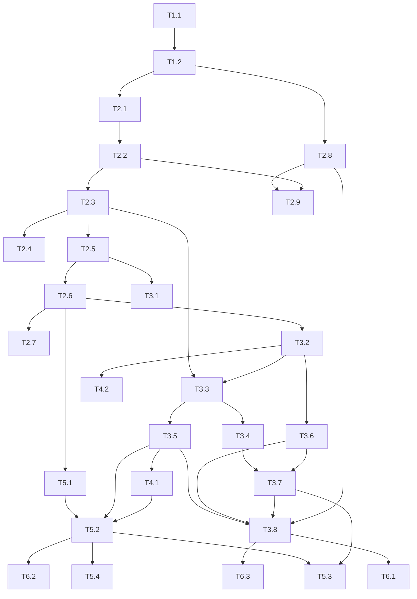

# Tasks: Signal Gym

**Status:** Draft
**Linked spec:** spec.md
**Linked PRD:** prd.md
**Last updated:** 2026-06-27

Build order (resolved): **baseline-first**. Stand up `collect → build → env →
supervised baseline → analyze → validate` end-to-end (Phases 1–4), which exercises the
whole pipeline and produces the first signal-edge report, *then* drop in PPO (Phase 5).
The `--agent sup|ppo` flag runs both under the identical checkpoint/eval protocol.
Episode shape = whole-history per ticker, reshuffled order. Action = continuous weight
[0,1] with a discrete {0,.25,.5,.75,1} mode available.

Estimates: S < 1hr · M 1–4hr · L > 4hr (one Claude `archon-code` run per task).

---

## Phase 1: Foundation
*Goal: the `gym/` package is importable, configured, and test-runnable from empty.*

- [ ] **T1.1 — Package scaffold, Config, dependencies, test harness**
  - **Description:** Create the `gym/` Python package (`__init__.py`, module stubs per
    spec §2), a `config.py` with a single `Config` dataclass holding all defaults
    (tickers path, timeframes, horizons H=6, lookback W=30, commission_bps=10,
    reward_decay=0.02, split ratios 0.70/0.15/0.15, seed=42, PPO/GBT param blocks),
    a `requirements.txt` pinning §6 deps, and a `tests/` dir wired for `pytest`.
  - **Files:** `gym/__init__.py`, `gym/config.py`, `gym/{collect,features,env,agent_sup,agent_rl,train,backtest,valid,analysis,baselines,monitor,replay,run}.py` (stubs), `gym/requirements.txt`, `gym/tests/__init__.py`, `gym/tests/conftest.py`
  - **Depends on:** none
  - **Acceptance criteria:**
    - `python -c "import gym.config; print(gym.config.Config())"` prints a populated dataclass with every documented default.
    - `pytest gym/tests` collects and runs (zero tests pass is fine) with no import errors.
    - `pip install -r gym/requirements.txt` resolves on the local Python 3.11 venv.
  - **Risk:** low
  - **Estimate:** M

- [ ] **T1.2 — Ticker manifest + asset-class map**
  - **Description:** Author `gym/config/tickers.txt` from the existing 34
    `signal_study/results/effectiveness_*.json` symbols (one `EXCHANGE:TICKER` per
    line, `#` comments). Add an `asset_class` lookup (index/equity/commodity/ETF →
    {0,1,2,3}) in `config.py` covering every ticker.
  - **Files:** `gym/config/tickers.txt`, `gym/config.py`
  - **Depends on:** T1.1
  - **Acceptance criteria:**
    - `tickers.txt` lists all 34 current symbols; a loader returns them as `EXCHANGE:TICKER` strings.
    - `asset_class_of(symbol)` returns a value in {0,1,2,3} for every ticker in the manifest; a unit test asserts no ticker maps to `None`.
  - **Risk:** low
  - **Estimate:** S

---

## Phase 2: Core domain — data layer + environment (the no-lookahead core)
*Goal: causal feature matrices, 3-way splits, and a stepping env exist and are
leak-tested. This is the correctness-critical heart of the system.*

- [ ] **T2.1 — features.py: loader + meta/exec/price features**
  - **Description:** Load a legacy-or-augmented `results/*.json` into a per-bar 1D
    DataFrame: `ticker,timestamp,open,high,low,close,volume` (OHLCV when present, else
    close with OHLC=close fallback), `fill_price = open.shift(-1)` (else
    `close.shift(-1)`), and trailing price features `ret_1/3/6, vol_20, range_pos_20,
    drawdown_20, atr_14` (all `min_periods`-guarded, strictly trailing).
  - **Files:** `gym/features.py`, `gym/tests/test_features_price.py`
  - **Depends on:** T1.2
  - **Acceptance criteria:**
    - On a hand-built 10-bar fixture, every price feature matches a precomputed expected value.
    - `fill_price[t] == open[t+1]` (or `close[t+1]` fallback); last row's `fill_price` is NaN.
    - No price feature at bar t reads any value from bars > t (asserted by a shift-invariance check).
  - **Risk:** med — leakage-sensitive; trailing windows must never center.
  - **Estimate:** M

- [ ] **T2.2 — features.py: signal, condition, interaction & context features**
  - **Description:** From the JSON's signals, build per-event-signal features for
    **all** event plots (`{sig}_fired, _bars_since(cap 50), _ever, _within_3`);
    condition/regime features (`bull_active_count, bear_active_count,
    continuation_active, cloud_state∈{-1,0,1}, background_active, points_active`);
    interaction `htf_bull_confirm_4h, htf_bear_confirm_4h` (4H same-side fires within 1
    daily bar, causal); context `asset_class`, and `vol_regime` placeholder (terciles
    applied in T2.3). Slugify names via `confluence.short()`.
  - **Files:** `gym/features.py`, `gym/tests/test_features_signals.py`
  - **Depends on:** T2.1
  - **Acceptance criteria:**
    - On a fixture with known fire timestamps, `_fired/_bars_since/_within_3` and `bull_active_count` match expected values bar-by-bar.
    - `cloud_state` collapses the four Senkou plots to a single {-1,0,1} correctly.
    - `htf_*_confirm_4h` uses only 4H fires at or before bar t (causality asserted).
    - Every event signal in the source JSON appears as feature columns (no signal dropped at the data layer).
  - **Risk:** med
  - **Estimate:** M

- [ ] **T2.3 — features.py: target, 3-way splits, train-only normalizers, parquet writer**
  - **Description:** Compute supervised target `fwd_edge_6 = fwd_ret_6 −
    baseline_long_6` (+ raw `fwd_ret_6`), NaN on last 6 bars. Implement `make_splits`
    (training/validation/test ≈ 70/15/15, stratified by `asset_class`, deterministic by
    seed). Fit `vol_regime` terciles and continuous z-score stats on **training rows
    only**, store in `splits.json`, apply to all. Write one parquet per ticker +
    `splits.json`.
  - **Files:** `gym/features.py`, `gym/tests/test_splits.py`
  - **Depends on:** T2.2
  - **Acceptance criteria:**
    - `build_features()` writes 34 parquets + `splits.json`; reload round-trips dtypes.
    - Splits are disjoint, cover every ticker, each set contains ≥1 ticker of each asset class present, and are identical across two seeded runs.
    - Target is NaN exactly on each ticker's last 6 bars and finite elsewhere where price exists.
  - **Risk:** med
  - **Estimate:** M

- [ ] **T2.4 — features.py: leakage test-suite (critical)**
  - **Description:** Dedicated tests proving the three causality guarantees: (a)
    feature@t depends only on bars ≤ t; (b) normalizers fit on train only — mutating a
    test/validation ticker's values does not change any training row's `vol_regime` or
    z-scores; (c) target uses only future data and is NaN on the final H bars.
  - **Files:** `gym/tests/test_no_lookahead.py`
  - **Depends on:** T2.3
  - **Acceptance criteria:**
    - Perturbing bar t+k (k>0) leaves every feature at bar t byte-identical for a sample of bars across tickers.
    - Editing test-set rows and rebuilding normalizers yields identical train-row normalized values.
    - Suite is green and covers features.py ≥ 90%.
  - **Risk:** high — a missed leak invalidates every downstream result.
  - **Estimate:** M

- [ ] **T2.5 — env.py: Gymnasium mechanics (spaces, step, fills, costs, equity)**
  - **Description:** `SignalGymEnv` over one ticker DataFrame: observation = `(lookback,
    n_features)` live window; action = continuous weight [0,1] (+ discrete mode);
    `reset/step` with next-bar-open fill, commission on |Δw|, position/equity and
    B&H-equity tracking, rich `info` (position, weight, equity, bh_equity, trade,
    bar_idx, active_signals). Reward returns 0 for now (added in T2.6).
  - **Files:** `gym/env.py`, `gym/tests/test_env_mechanics.py`
  - **Depends on:** T2.3
  - **Acceptance criteria:**
    - A scripted action sequence yields hand-computed weight, equity, and B&H-equity at each step (§5.4 accounting).
    - Cost is charged exactly `commission_bps/1e4 · |Δw|` on rebalances and zero when weight is unchanged.
    - `observation_space`/`action_space` match shapes; `gymnasium.utils.env_checker.check_env` passes.
  - **Risk:** med
  - **Estimate:** M

- [ ] **T2.6 — env.py: differential-Sharpe excess reward**
  - **Description:** Implement reward = differential Sharpe of excess-over-B&H
    (`x_{t+1}`), EMA mean/var with `η=reward_decay`, denominator floor ε, `lookback`-bar
    warmup (reward 0 during warmup), minus the turnover term already in the return.
  - **Files:** `gym/env.py`, `gym/tests/test_env_reward.py`
  - **Depends on:** T2.5
  - **Acceptance criteria:**
    - On a synthetic ticker where the strategy beats B&H, cumulative reward is positive; where it underperforms, negative.
    - Reward is exactly 0 for the first `lookback` post-reset steps (warmup) and finite (no div-by-zero) when variance starts at 0.
    - A flat (always-0-weight) policy yields ~0 excess and bounded reward.
  - **Risk:** med — degenerate-reward risk; this test is the guardrail.
  - **Estimate:** M

- [ ] **T2.7 — env.py: observation causality test**
  - **Description:** Prove the env never leaks the future into an observation: the obs
    returned at bar t contains no value from bar t+1+, and the fill that realizes a
    weight uses bar t+1's price, not bar t's.
  - **Files:** `gym/tests/test_env_no_lookahead.py`
  - **Depends on:** T2.6
  - **Acceptance criteria:**
    - The last row of every obs equals the feature row at the current bar index, never beyond.
    - Mutating bar t+1's features after `step(t)` returns does not change the obs that `step(t)` already produced.
    - env.py coverage ≥ 90%.
  - **Risk:** high
  - **Estimate:** S

- [ ] **T2.8 — collect.py: full-suite scrape (OHLCV + continuous values)**
  - **Description:** Extend the existing CDP extractor to capture, per ticker/TF, full
    OHLCV **and every indicator plot** — sparse `fires` and `continuous` per-bar
    `values` (with `kind` tag) — into the augmented `results/*.json` (spec §3.2).
    Idempotent/resumable per ticker; reads `tickers.txt`.
  - **Files:** `gym/collect.py` (reuse `signal_study/extract_and_score.py` patterns), `gym/tests/test_collect_schema.py`
  - **Depends on:** T1.2
  - **Acceptance criteria:**
    - Running `collect` on ≥1 live ticker writes an augmented JSON with `series.{o,h,l,c,v}` and at least one signal carrying `kind:"continuous"` + `values`.
    - A schema test validates the augmented shape against existing legacy files (legacy still load).
    - Re-running skips already-collected tickers unless `--force`.
  - **Risk:** high — depends on live TradingView + CDP (port 9222); flaky UI timing. Falls back gracefully (features work close-only without this).
  - **Estimate:** L

- [ ] **T2.9 — features.py: continuous-value features + OHLC fills**
  - **Description:** Once augmented data exists, add per-continuous-signal features
    (`{sig}_val` z-scored on train, `{sig}_slope_3`) and switch fills to real next-bar
    `open`. No downstream signature changes (columns were reserved).
  - **Files:** `gym/features.py`, `gym/tests/test_features_continuous.py`
  - **Depends on:** T2.8, T2.2
  - **Acceptance criteria:**
    - Continuous features appear only when augmented data is present; absence triggers the documented close-only fallback without error.
    - `{sig}_val` is z-scored with train-only stats; `{sig}_slope_3` is causal.
    - The T2.4 leakage suite still passes with continuous features included.
  - **Risk:** med
  - **Estimate:** M

---

## Phase 3: Surfaces — baseline agent, backtest, analysis, validation, CLI
*Goal: the supervised pipeline runs end-to-end and emits the first signal-edge report
and validation p-values.*

- [ ] **T3.1 — baselines.py: buy-and-hold + logged rule policies**
  - **Description:** Implement `BuyAndHoldPolicy` and `RulePolicy` for A3, A5b, Prophet
    Confluence Buy, ported from `signal_study/backtest.py`, as env-compatible
    `act(obs)->weight` policies.
  - **Files:** `gym/baselines.py`, `gym/tests/test_baselines.py`
  - **Depends on:** T2.5
  - **Acceptance criteria:**
    - `BuyAndHoldPolicy.act` always returns 1.0.
    - Each rule policy's entry bars match `signal_study/backtest.py` on a shared fixture ticker.
  - **Risk:** low
  - **Estimate:** M

- [ ] **T3.2 — backtest.py: run_backtest, metrics, vectorized fast-path + env parity**
  - **Description:** `run_backtest(env, policy) -> BacktestResult` (trades, equity
    curve, metrics: excess_return_pa, sharpe_excess, exposure_pct, n_trades, win_rate,
    avg_trade, max_dd, max_dd_bh, beats_bh). Plus `fast_vectorized` reproducing the env
    accounting as array ops, asserted equal to the env loop.
  - **Files:** `gym/backtest.py`, `gym/tests/test_backtest.py`
  - **Depends on:** T2.6
  - **Acceptance criteria:**
    - On buy-and-hold, `excess_return_pa ≈ 0`, `exposure_pct == 100`, equity == B&H equity within float tol.
    - `fast_vectorized` equity curve matches the env-loop equity curve within 1e-9 for a fixed policy (env↔vectorized parity).
    - Metrics dict contains every documented key with correct types.
  - **Risk:** med
  - **Estimate:** M

- [ ] **T3.3 — agent_sup.py: LightGBM edge-model + sizing policy**
  - **Description:** `train_edge_model` (objective `regression_l1`/`huber`, regularized
    + deterministic per spec D18) on pooled training rows; `calibrate_sizing` (thr=0,
    scale to train 90th-pct edge → w≈0.9, train-only); `edge_to_weight` (sigmoid);
    `EdgePolicy.act`.
  - **Files:** `gym/agent_sup.py`, `gym/tests/test_agent_sup.py`
  - **Depends on:** T2.3, T3.2
  - **Acceptance criteria:**
    - On synthetic data with one planted predictive feature, that feature lands in the top-3 importances and the model's val RMSE beats a mean predictor.
    - `edge_to_weight` is monotone non-decreasing in edge and clamped to [0,1]; calibration touches train rows only (asserted).
    - Two seeded training runs produce identical boosters.
  - **Risk:** med
  - **Estimate:** M

- [ ] **T3.4 — agent_sup.py: feature importances + SHAP attributions**
  - **Description:** `feature_importances` (gain) and `shap_attributions` returning
    per-feature mean |SHAP| over an evaluation set.
  - **Files:** `gym/agent_sup.py`, `gym/tests/test_attribution.py`
  - **Depends on:** T3.3
  - **Acceptance criteria:**
    - Both return DataFrames ranked descending; the planted feature ranks #1 on the synthetic set in both.
    - SHAP runs on a real ticker subset without error and sums to the model's output shift within tol.
  - **Risk:** low
  - **Estimate:** S

- [ ] **T3.5 — train.py: checkpoint/eval protocol (supervised path)**
  - **Description:** `training_run` for `--agent sup`: fit on pooled training rows, then
    run the **eval protocol** — backtest on all validation tickers (pooled
    sharpe_excess, beat-rate) for selection, and a single final pass on test tickers.
    Emits per-checkpoint history and saves model + `meta.json`.
  - **Files:** `gym/train.py`, `gym/tests/test_train_protocol.py`
  - **Depends on:** T3.3, T3.2
  - **Acceptance criteria:**
    - Produces a `RunResult` with validation metrics and exactly one test evaluation; test tickers are not read before the final pass (asserted via access guard/spy).
    - `meta.json` records config, feature list, split, metrics, and git commit.
  - **Risk:** med
  - **Estimate:** M

- [ ] **T3.6 — valid.py: MCPT + runs test**
  - **Description:** `mcpt` (sign-flip permutation, pooled OOS excess returns, p-value)
    and `runs_test` (Wald–Wolfowitz on pooled trade returns).
  - **Files:** `gym/valid.py`, `gym/tests/test_valid.py`
  - **Depends on:** T3.2
  - **Acceptance criteria:**
    - MCPT on random-sign returns gives p≈0.5 (±0.05); on strongly positive returns p<0.01.
    - Runs test on IID Bernoulli returns is non-significant; on a perfectly alternating sequence is significant.
  - **Risk:** low
  - **Estimate:** M

- [ ] **T3.7 — analysis.py: signal-edge report (deliverable D-B)**
  - **Description:** `build_edge_report` assembling (1) solo-signal edge pooled over OOS
    (reuse `signal_study` stats), (2) condition/interaction edge (confluence pairs,
    regime-gated buckets, cross-TF, vol_regime buckets) with lift, (3) GBT importances +
    SHAP. RL ablation left as a stub (filled in T5.3). Writes `gym/reports/edge_report.json`
    + a printed leaderboard.
  - **Files:** `gym/analysis.py`, `gym/tests/test_edge_report.py`
  - **Depends on:** T3.4, T3.6
  - **Acceptance criteria:**
    - `edge_report.json` validates against a documented schema and contains all three populated sections + an ablation stub.
    - The printed leaderboard ranks signals/conditions by edge with sample-n and significance, and every signal in the universe appears (even rare ones, flagged low-n).
  - **Risk:** med
  - **Estimate:** L

- [ ] **T3.8 — run.py: CLI wiring**
  - **Description:** Wire `collect/build/train/eval/analyze/validate/replay/report`
    subcommands (argparse) to their modules with the documented flags.
  - **Files:** `gym/run.py`, `gym/tests/test_cli.py`
  - **Depends on:** T3.5, T3.6, T3.7, T2.8
  - **Acceptance criteria:**
    - `python -m gym.run build` then `... train --agent sup` then `... validate --scope test` then `... analyze` run to completion on the real 34-ticker data.
    - `--help` lists every subcommand; unknown flags exit non-zero with a usage message.
  - **Risk:** med
  - **Estimate:** M

---

## Phase 4: Visualization
*Goal: the training process is watchable live and a trained policy is replayable.*

- [ ] **T4.1 — monitor.py: live training dashboard**
  - **Description:** `TrainingEvent`, `TrainingMonitor` (pyqtgraph 4-panel: learning
    curve, validation Sharpe-of-excess, live equity-vs-B&H on a validation ticker,
    top-N importances), thread-safe `emit`, Qt-timer drain, and `LiveBacktestCallback`
    integrated into `train.py --monitor`.
  - **Files:** `gym/monitor.py`, `gym/tests/test_monitor.py`
  - **Depends on:** T3.5, T3.2
  - **Acceptance criteria:**
    - `train --agent sup --monitor` opens a 4-panel window that updates ≥ once per checkpoint and freezes final state on completion.
    - Headless unit test: feeding a synthetic `TrainingEvent` stream updates the four panel data series without a display (offscreen Qt).
  - **Risk:** med — GUI/threading.
  - **Estimate:** L

- [ ] **T4.2 — replay.py: finplot bar-stepped replay**
  - **Description:** `replay(result, ticker_df, signal_cols, speed)` — candles (or close
    line fallback), active-signal markers, position shading by weight, trade arrows,
    equity-vs-B&H sub-pane, live readout; Space/←/→/↑/↓/Q controls; ≥10 bars/sec.
  - **Files:** `gym/replay.py`
  - **Depends on:** T3.2
  - **Acceptance criteria:**
    - `python -m gym.run replay <TICKER> --agent sup` plays the backtest with trades and equity aligned to the bars; manual check confirms controls and ≥10 bars/sec.
    - Renders without OHLC (close-line fallback) when augmented data is absent.
  - **Risk:** med
  - **Estimate:** L

---

## Phase 5: Reinforcement learning (the primary learner)
*Goal: PPO learns by playing through the training tickers and is benchmarked, with the
edge report completed by agent-side attribution.*

- [ ] **T5.1 — agent_rl.py: PPO env wrapping + RLPolicy**
  - **Description:** `make_vec_env` sampling episodes across training tickers, PPO setup
    (small MLP policy, entropy reg), `RLPolicy.act` for eval/replay.
  - **Files:** `gym/agent_rl.py`, `gym/tests/test_agent_rl_smoke.py`
  - **Depends on:** T2.6
  - **Acceptance criteria:**
    - PPO trains for a short budget on a planted-edge synthetic ticker and its validation Sharpe-of-excess rises above a flat policy.
    - `RLPolicy.act` returns a weight in [0,1] for a real observation.
  - **Risk:** med
  - **Estimate:** M

- [ ] **T5.2 — train.py: episodic playthrough loop (RL path)**
  - **Description:** `--agent ppo`: shuffle training tickers (reshuffle each pass),
    whole-history episode rollouts, policy updates, checkpoint eval on validation,
    early-stop on patience, final single test eval; stream `TrainingEvent`s to the
    monitor.
  - **Files:** `gym/train.py`, `gym/tests/test_train_rl.py`
  - **Depends on:** T5.1, T3.5, T4.1
  - **Acceptance criteria:**
    - A short RL run reshuffles ticker order each pass (asserted), checkpoints, early-stops on no val improvement, and evaluates test exactly once.
    - The monitor's panel B (val Sharpe) updates per checkpoint during the run.
  - **Risk:** med
  - **Estimate:** L

- [ ] **T5.3 — analysis.py: RL feature-ablation attribution (completes D-B)**
  - **Description:** `ablate_feature` (zero/shuffle a feature, re-eval ΔSharpe-of-excess
    of the trained policy) and integrate the deltas into `edge_report.json`.
  - **Files:** `gym/analysis.py`, `gym/tests/test_ablation.py`
  - **Depends on:** T5.2, T3.7
  - **Acceptance criteria:**
    - On a synthetic agent that trades only on feature X, ablating X yields the largest negative ΔSharpe.
    - `edge_report.json`'s ablation section is populated and ranked, replacing the T3.7 stub.
  - **Risk:** med
  - **Estimate:** M

- [ ] **T5.4 — PPO stabilization + benchmark vs baseline/B&H**
  - **Description:** Reward-shaping/entropy/turnover tuning and degenerate-policy guards
    (detect always-flat / always-100%); produce the comparison table: PPO vs supervised
    baseline vs B&H vs logged rules on validation and test, with MCPT/runs test.
  - **Files:** `gym/train.py`, `gym/config.py`, `gym/reports/comparison.md`
  - **Depends on:** T5.2
  - **Acceptance criteria:**
    - The trained PPO policy is non-degenerate (exposure strictly between 0% and 100%, ≥ a configured number of distinct weights) on validation.
    - A comparison report ranks all policies by sharpe_excess on test with MCPT p-values.
  - **Risk:** high — PPO may not stabilize on ~24 short episodes; fallback is the supervised baseline as the shipped agent and/or a contextual-bandit simplification (spec §12 Q2).
  - **Estimate:** L

---

## Phase 6: Quality, reproducibility, docs
*Goal: the system is honest, reproducible, and documented.*

- [ ] **T6.1 — End-to-end integration test**
  - **Description:** A pipeline test over 2–3 fixture tickers: `build → train --agent sup
    → analyze → validate`, asserting artifacts and metric sanity.
  - **Files:** `gym/tests/test_pipeline_e2e.py`
  - **Depends on:** T3.8
  - **Acceptance criteria:**
    - The test runs the full supervised pipeline headlessly and asserts parquets, `splits.json`, `meta.json`, and `edge_report.json` are produced with valid schemas.
    - Buy-and-hold through the same pipeline reports ~0 excess (sanity floor).
  - **Risk:** low
  - **Estimate:** M

- [ ] **T6.2 — Reproducibility & determinism**
  - **Description:** Centralize seeding (numpy, LightGBM, torch/SB3), assert
    identical-config+data ⇒ identical results, and stamp `meta.json` with git commit +
    full config.
  - **Files:** `gym/config.py`, `gym/train.py`, `gym/tests/test_reproducibility.py`
  - **Depends on:** T3.5, T5.2
  - **Acceptance criteria:**
    - Two seeded supervised runs produce byte-identical `edge_report.json` and model files.
    - A seeded short PPO run reproduces its checkpoint metrics across two invocations.
  - **Risk:** med — RL determinism can be platform-sensitive; document any irreducible nondeterminism.
  - **Estimate:** M

- [ ] **T6.3 — Usage docs**
  - **Description:** `gym/README.md`: install, `collect/build/train/analyze/validate/
    replay` walkthrough, how to read the edge report, and the no-lookahead guarantees.
  - **Files:** `gym/README.md`
  - **Depends on:** T3.8
  - **Acceptance criteria:**
    - A reader can run the supervised pipeline end-to-end from the README alone.
    - The edge-report section explains each of solo/interaction/SHAP/ablation columns.
  - **Risk:** low
  - **Estimate:** S

---

## Dependency graph

## Open questions (non-blocking — empirical, answered by running the pipeline)
- **Does the edge survive?** (spec §12 Q1 / PRD killer risk.) First experiment after
  T3.7+T3.8+T3.6: pooled-OOS MCPT on test tickers + the solo/interaction edge report. A
  null result invalidates the premise and must be reported honestly — it does not block
  building, but gates whether Phase 5 RL is worth tuning.
- **PPO stability on small data** (spec §12 Q2) — concentrated in T5.4 (risk: high).
  Supervised baseline is the fallback shipped agent if PPO won't stabilize.
- Resolved and baked into tasks: build order (baseline-first), 3-way ticker split,
  whole-history reshuffled episodes, continuous action with discrete mode, capture-all
  signals.
